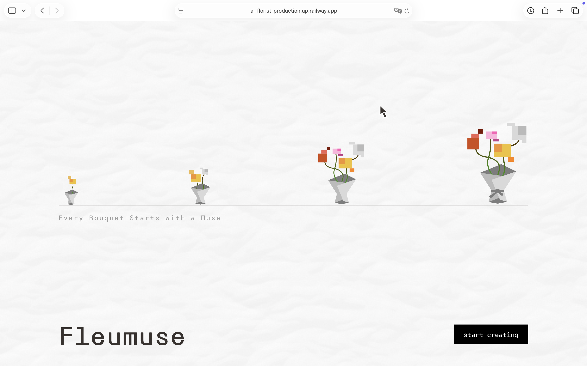
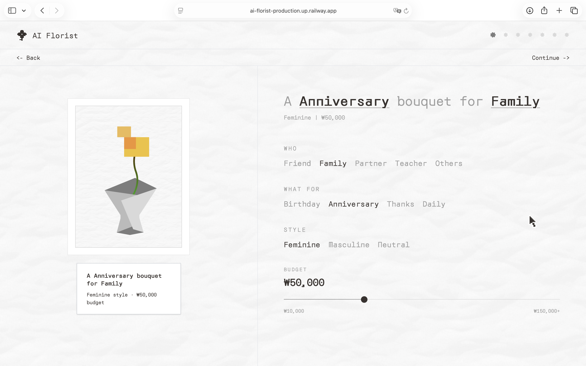
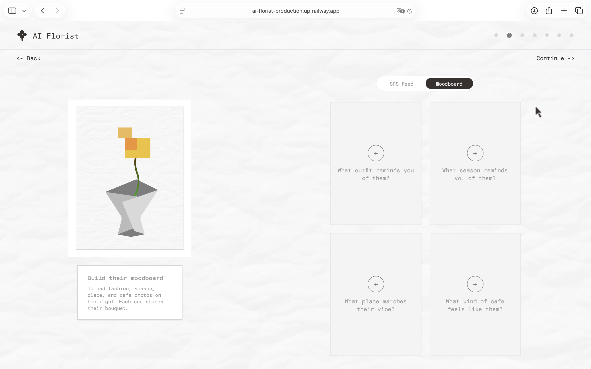
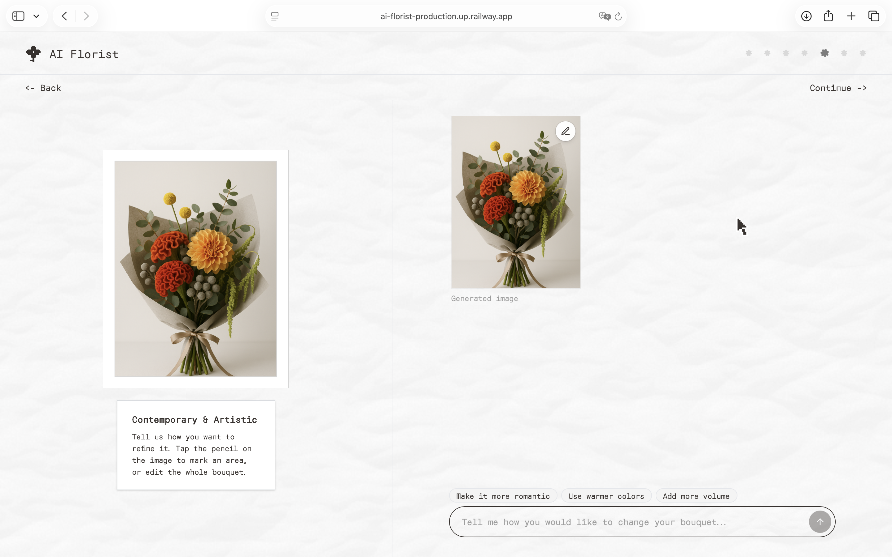
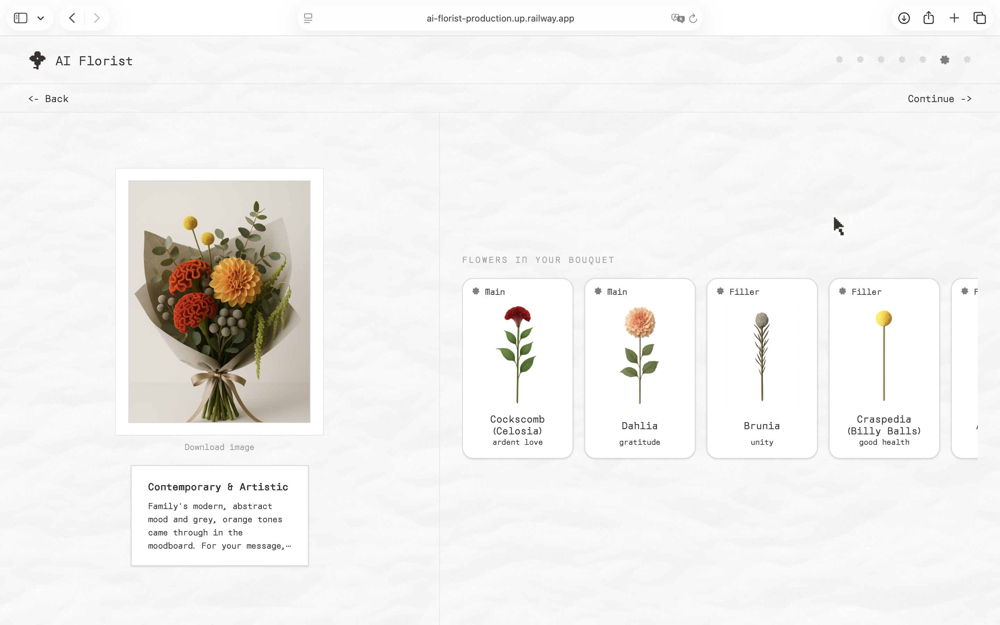
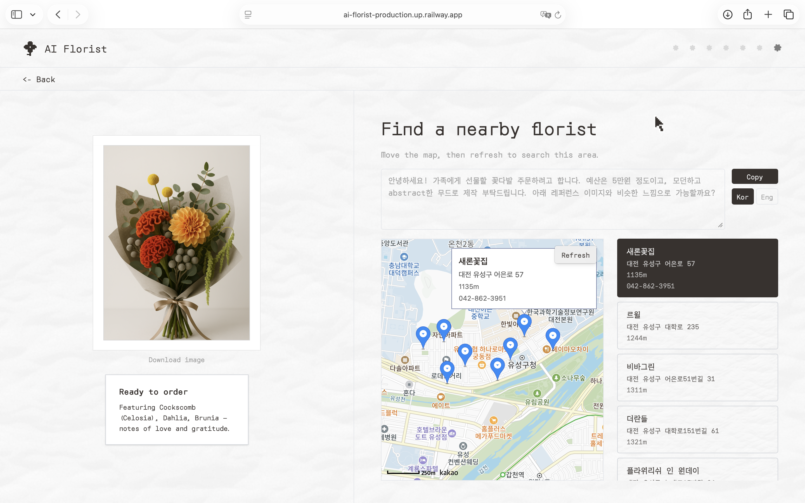
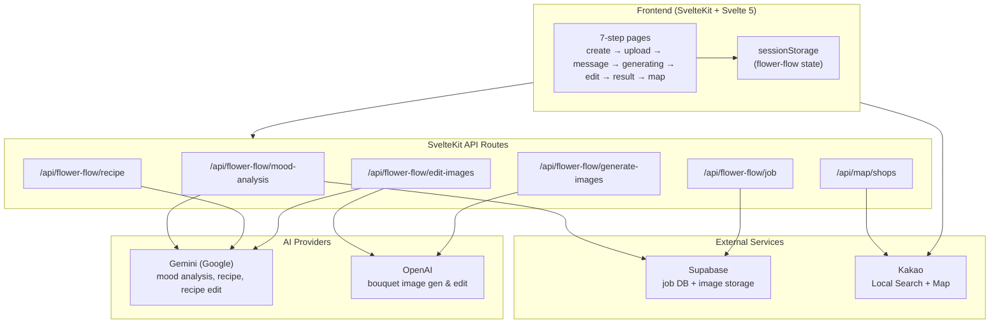
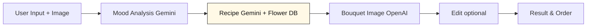
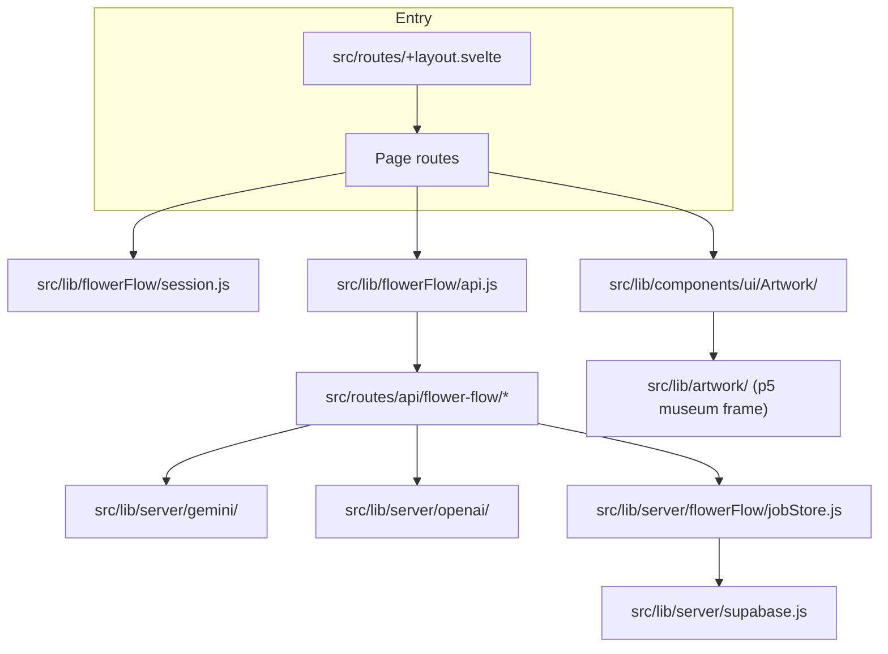

# Fleumuse (AI Florist)

## Author and links

| Field       | Info                                          |
| ----------- | --------------------------------------------- |
| Source code | https://github.com/codenamewont/ai-florist    |
| Live site   | https://ai-florist-production.up.railway.app/ |
| Demo video  | https://youtu.be/m0v6wYegKc0                  |

| Name        | Student ID | Email                  |
| ----------- | ---------- | ---------------------- |
| Chaewon Lee | 20220552   | leechaewon@kaist.ac.kr |
| Jieun Lee   | 20254499   | wldms47@kaist.ac.kr    |

## Screenshots

<table width="100%">
  <colgroup>
    <col width="50%" />
    <col width="50%" />
  </colgroup>
  <tr>
    <th align="center" width="50%">Landing</th>
    <th align="center" width="50%">Create</th>
  </tr>
  <tr>
    <td align="center" valign="top" width="50%"></td>
    <td align="center" valign="top" width="50%"></td>
  </tr>
  <tr>
    <th align="center" width="50%">Upload &amp; generating</th>
    <th align="center" width="50%">Edit</th>
  </tr>
  <tr>
    <td align="center" valign="top" width="50%"></td>
    <td align="center" valign="top" width="50%"></td>
  </tr>
  <tr>
    <th align="center" width="50%">Result</th>
    <th align="center" width="50%">Map</th>
  </tr>
  <tr>
    <td align="center" valign="top" width="50%"></td>
    <td align="center" valign="top" width="50%"></td>
  </tr>
</table>

## How to run it

Run `npm install` once. Copy `.env.example` to `.env` and fill in the API keys (Gemini, OpenAI, Supabase, Kakao). Then run `npm run dev` and open the local address Vite prints (often port 5173).

For a production build use `npm run build` and `npm start` (Node adapter).

**Deployed build:** The live URL above is hosted on **Railway** with `@sveltejs/adapter-node`. Generated bouquet images and job state are stored in **Supabase** (table `flower_jobs`, bucket `flower-bouquets`; see `supabase/schema.sql`). The `/map` page needs your Railway domain registered in [Kakao Developers](https://developers.kakao.com) under Web platform site domains.

| Variable                                    | Purpose                            |
| ------------------------------------------- | ---------------------------------- |
| `GEMINI_API_KEY`                            | Mood analysis, recipe, recipe edit |
| `OPENAI_API_KEY`                            | Bouquet image generate & edit      |
| `SUPABASE_URL`, `SUPABASE_SERVICE_ROLE_KEY` | Job DB + image storage             |
| `KAKAO_REST_API_KEY`                        | Shop search (`/api/map/shops`)     |
| `PUBLIC_KAKAO_MAP_KEY`                      | Map display on `/map`              |

Optional: `npm run generate:flowers` batch-generates catalog PNGs via OpenAI (assets already live under `static/flowers/`).

## What the app is

**Fleumuse** is a museum-inspired web app for designing a personal bouquet. You know who the flowers are for and the feeling you want to send, but picking the right bouquet is still hard. This app uses that context (photos, style, and your card message) to suggest a bouquet you can refine and then order from a real florist nearby.

You do not start by picking random flowers. You start with **someone**. On **Create** you choose recipient, occasion, style, budget, and season. On **Upload** you add a four-tile moodboard or one SNS-style feed image. On **Message** you write the card text. The app then analyzes mood, builds a recipe from a **93-flower catalog**, and generates a bouquet preview.

On **Edit** you refine the image in a chat UI. You can draw on the bouquet with a pencil tool to edit one area only (for example ribbon color). On **Result** you see the final preview, scroll through flower cards, and flip each card for Korean/English flower language. On **Map** you find nearby florists and copy a florist order message in Korean or English.

The left panel keeps a fixed museum frame across steps; only the inner artwork and description card change. **← Back / Continue →** navigation sits under the header, and `sessionStorage` keeps your inputs when you go back.

```
Landing → Create → Upload → Message → Generating → Edit → Result → Map
```

| Step | Route         | What the user does                                |
| ---- | ------------- | ------------------------------------------------- |
| 1    | `/`           | Read the concept; tap **start creating**          |
| 2    | `/create`     | Recipient, occasion, style, budget, season        |
| 3    | `/upload`     | Moodboard (4 tiles) or SNS feed image             |
| 4    | `/message`    | Card message or preset                            |
| 5    | `/generating` | Wait for mood analysis, recipe, and bouquet image |
| 6    | `/edit`       | Chat refinement; optional area selection          |
| 7    | `/result`     | Final preview, flower cards, image download       |
| 8    | `/map`        | Nearby florists, copyable order note (Kor/Eng)    |

## How the code is organized

The app uses **SvelteKit 2** and **Svelte 5** (runes) with **Tailwind CSS v4**. Pages live under `src/routes/`. Shared UI is under `src/lib/components/ui/`. Flow logic and API calls sit in `src/lib/flowerFlow/`. Server-only AI and DB code is under `src/lib/server/`.

Each page is a thin route file that composes components. The **flower-flow** API routes handle mood analysis, recipe building, image generation, edits, and job polling. The client keeps a `jobId` in `sessionStorage` (`session.js`) and fetches job state from the server after each step.

`flowerDB.js` holds 93 flowers with mood, season, price, and role tags. `matchFlowersFromMood` scores candidates locally. **Gemini** turns mood + candidates into a JSON recipe and updates the recipe after text edits. **OpenAI** generates and edits the bouquet image from strict prompts in `bouquetImageFormat.js` (3:4 aspect, catalog scene, no hands/people). Images upload to Supabase Storage; the DB stores URLs only (`jobStore.js`).

The map page calls our `/api/map/shops` proxy, which uses the **Kakao Local REST API**. The map tile layer uses the **Kakao JavaScript Map SDK** in the browser. The museum frame on the left uses **p5.js** (`MuseumFrame.svelte`, `drawMuseumFrame.js`).

### System architecture



### AI pipeline



| Stage                     | Provider                    | Output                                              |
| ------------------------- | --------------------------- | --------------------------------------------------- |
| User Input + Image        | Frontend + upload API       | User context and moodboard / feed image             |
| Mood Analysis Gemini      | Gemini Vision               | Color palette, mood/style keywords, energy level    |
| Recipe Gemini + Flower DB | Gemini Text + `flowerDB.js` | JSON recipe (flowers, colors, wrapping, shape)      |
| Bouquet Image OpenAI      | OpenAI Images               | 768×1024 bouquet PNG → Supabase                     |
| Edit optional             | OpenAI + Gemini             | Updated image; recipe synced on flower changes      |
| Result & Order            | Frontend + Kakao            | Flower cards, download, nearby florists, order note |

### Simple picture of the folders



### Main modules

| Module / file                              | Main job                                                        |
| ------------------------------------------ | --------------------------------------------------------------- |
| `session.js`                               | `sessionStorage` state: userInput, jobId, uploads, card message |
| `api.js`                                   | Client fetch wrappers for all flower-flow endpoints             |
| `flowerDB.js`                              | 93-flower catalog; mood/season/price scoring                    |
| `gemini/vision.js`                         | Uploaded image → mood JSON                                      |
| `gemini/text.js`                           | Mood → recipe; edit-time recipe updates (catalog names only)    |
| `openai/image.js`                          | Bouquet image generation and edits                              |
| `bouquetImageFormat.js`                    | Shared prompt strings (aspect ratio, strict recipe, no person)  |
| `resolveRecipeFlowers.js`                  | Recipe flower names → result carousel cards                     |
| `areaEditIntent.js` + `refinedAreaMask.js` | Pencil selection → partial edit prompt                          |
| `Artwork.svelte` + `MuseumFrame.svelte`    | Fixed left exhibit panel; inner image swaps per step            |
| `buildFloristOrderMessage.js`              | Kor/Eng order text for `/map`                                   |

We did not use a heavy framework pattern. Most flow goes through the page routes plus `flowerFlow/` helpers on the client and `server/` modules on the API side. Both team members wrote and tuned the prompts sent on API calls (mood analysis, recipe, bouquet image generation, area edit). Shared prompt text lives mainly in `bouquetImageFormat.js`, `gemini/vision.js`, `gemini/text.js`, and `areaEditIntent.js`.

### Team split

| Member      | Main areas                                                                                         |
| ----------- | -------------------------------------------------------------------------------------------------- |
| Chaewon Lee | Backend API, Supabase, upload/edit/result UI, flowerDB, API prompt engineering, deploy             |
| Jieun Lee   | Create & message UI, Kakao map & order message, museum frame, catalog PNGs, API prompt engineering |

## Issues and limits you should know

- **Bouquet realism:** Strict recipe prompts help flower accuracy but can make images look less photorealistic. We tuned this tradeoff in `bouquetImageFormat.js`.
- **Area edit:** Partial edits (e.g. ribbon color) work best with clear prompts. Vague commands like “use the other color” can still change the wrong region.
- **Cards vs. photo:** Result cards follow the **recipe**. The generated photo may show extra stems not on the cards. After edit, recipe and cards sync when Gemini updates the recipe correctly.
- **Kakao Map:** The production domain must be registered in Kakao Developers or map tiles will not load.
- **Dev seed:** A floating **Dev Fill** button in dev builds pre-fills the flow so we can jump between steps without re-entering data.
- **API keys required:** Mood analysis, image generation, Supabase, and map features need valid env vars; without them the app falls back to mocks or shows errors.

## Special bits worth mentioning

- **Personalized recipe, not random flowers:** Mood from uploaded photos is scored against a real 93-flower catalog. Card message sentiment can steer main flower choice via flower language.
- **Museum UI:** A p5-drawn frame stays fixed while artwork and copy change per step, like walking through a small exhibition.
- **Edit like chat:** Whole-bouquet reprompting plus pencil area selection for local changes (ribbon, one stem, etc.).
- **Flip flower cards:** Tap a card on `/result` to see Korean/English meanings.
- **Real florist handoff:** `/map` searches nearby shops and builds a copyable order note from your recipe and mood keywords.
- **Beyond class topics:** Gemini + OpenAI APIs, Supabase, Kakao Maps, Sharp, Railway deploy.

## Credits and help

**AI tools:** We used **Cursor** during development. Prompt logs for submission:

- [`docs/chaewon_chatlog.md`](docs/chaewon_chatlog.md)
- [`docs/jieun_chatlog.md`](docs/jieun_chatlog.md)

**Documentation & APIs:** [SvelteKit](https://kit.svelte.dev/), [Google Gemini API](https://ai.google.dev/), [OpenAI API](https://platform.openai.com/), [Supabase](https://supabase.com/), [Kakao Developers](https://developers.kakao.com/), [Railway](https://railway.app/).
